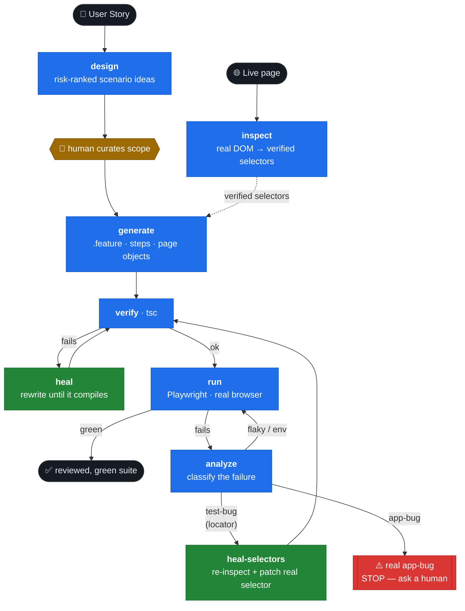

# aiwright — AI QA Agent

A Claude-powered BDD test-automation framework on TypeScript + **playwright-bdd**
(Gherkin → Playwright Test runner). It turns a plain-language user story into a working,
reviewed test suite — grounded in your app's **real DOM** and **real code**, not guesses.

> **What it is — a copilot for the *first draft* of your BDD tests.**
> You describe a feature; aiwright proposes *what to test* (risk-ranked scenarios you
> curate), grounds the code in the live **DOM** (inspected, verified selectors) and your
> existing **page objects/steps**, **self-heals until it compiles and runs**, and
> **classifies failures** so you know whether the test or the app is wrong.
>
> **What it is not** — an autonomous test writer that ships unreviewed tests. A human stays
> in the loop on every side-effecting step, and it never fakes a green test for behaviour
> your app does not have: a real app bug is *escalated*, not "healed" away.



> Drive it autonomously with the `agent`, or run each step yourself from the CLI. The two
> green nodes are the **self-heal** loops; a real **app bug** is escalated, never healed green.

## Setup

```bash
npm install
npx playwright install chromium
cp .env.example .env      # set ANTHROPIC_API_KEY (TARGET_URL defaults to https://getmobil.com)
```

---

## Two ways to drive it

### A) The autonomous agent (one command)

`agent` is an Anthropic tool-use loop that *sequences the whole pipeline itself* —
design → inspect → generate → verify → heal → run → analyze — pausing for your OK before
any side-effecting step, and self-healing failures along the way.

```bash
npm run ai:agent -- stories/getmobil-search.txt        # interactive: confirms inspect/generate/run
npm run ai:agent -- stories/getmobil-search.txt --auto  # CI / non-interactive: gates become non-blocking
```

It carries state across steps (verified selectors, generated files, run history) in
`reports/agent-run-<slug>.json`, so it reasons about the whole run instead of starting each
command from scratch.

**Guardrails — "amplify, don't replace":**
- Read-only steps (`design`, `verify`, `analyze`, `heal`) run automatically.
- Side-effecting steps (`inspect`, `generate`, `run`, `heal-selectors`) pause for a human OK
  (skipped under `--auto`, but the run record still shows what *would* have asked).
- **Semantic escalation:** if the agent decides a failure is a real **app bug** (not a test
  bug), it *stops and asks a human* — it will not rewrite the test to make a genuine
  regression go green.

### B) Step by step from the CLI

Each stage is also a standalone command — useful when you want to review between steps:

```bash
npm run ai:design   -- stories/getmobil-search.txt
npm run ai:inspect  -- https://getmobil.com
npm run ai:generate -- stories/getmobil-search.txt --design <report> --selectors <map>
npm run ai:analyze
```

---

## Self-healing

The feedback loop is closed in two places, both **bounded** (they stop and escalate instead
of looping forever) and both **honest** (a real app bug is never healed green):

| Layer | Trigger | What it does |
| --- | --- | --- |
| **`heal`** (compile) | `verify` (tsc) fails | Feeds the TypeScript errors + current sources back to the model and rewrites *only* what's needed to compile (merging new members into existing page objects). Re-verifies. |
| **`heal-selectors`** (runtime) | a scenario fails on a locator (timeout / strict-mode / not-visible) | Pulls the failing locator from the run report, **re-inspects the live page**, and patches the bad selector with a real one from the fresh map. Writes are confined to `src/pages`/`src/steps` with a `.bak` rollback, never touch Gherkin step text, and re-verify with `tsc`. |

A locator failure is treated as a **test bug**, not an app bug — the selector drifted, the
app didn't. Re-inspect + patch is exactly the right fix, and it's automatic.

---

## The pipeline stages

### `design` — *what to test* (no code)

From a user story, produces a **test design** for a human to review: risk areas, prioritised
scenario ideas, open questions (ambiguous requirements), assumptions, and deliberate
**out-of-scope** calls.

```bash
npm run ai:design -- stories/getmobil-search.txt
```

Output: `reports/test-design-<slug>.md`. Flow: review/edit → approve the scenarios → generate.

### `inspect` — real DOM, no guessing

Opens the live page and extracts a **stability-ranked selector map** from the DOM, so the
generator uses real selectors instead of guessing. Strategy priority:

```
test-id attribute  >  stable id  >  role + accessible name  >  static text  >  structural CSS
```

Recognised test-id attributes: `data-test`, `data-testid`, **`data-test-id`**, `data-cy`,
`data-qa`, `data-automation-id`, `data-e2e` — and the selector is built with the *actual*
attribute name found. Each selector is verified unique against the live DOM; ambiguous ones
are scoped to a stable ancestor; repeated list rows collapse to one representative to
parametrize. Page text is PII-redacted before the map is written.

```bash
npm run ai:inspect -- https://getmobil.com               # any public page
npm run ai:inspect -- "https://getmobil.com/ara/?term=iphone"   # a results/listing page
```

Output: `reports/selector-map-<slug>.json`. Accepts a full URL or a path resolved against
`BASE_URL`.

### `generate` — feature + steps + page objects

```bash
npm run ai:generate -- stories/getmobil-search.txt
```

**Grounded generation (recommended):**

```bash
npm run ai:generate -- stories/getmobil-search.txt \
  --design    reports/test-design-product-search-on-getmobil.md \  # exact scenarios to build
  --selectors reports/selector-map-getmobil-com.json \             # verified selectors, verbatim
  --max 2                                                          # quick trial: top N scenarios only
```

- `--design` makes the curated design the **authoritative scope** — it builds exactly those
  scenarios, inventing none and dropping none.
- `--selectors` makes the generator use the inspected selectors **verbatim** instead of
  guessing.
- `--max N` caps a fast trial run to the N highest-priority scenarios (works with `--design`).
- `--verify` type-checks the result; `--fix` runs the compile self-heal loop; `--run`
  executes the scenarios once they compile.

It never silently overwrites an existing file — on a conflict it writes a `.generated`
sibling. New page objects come with a fixture-registration snippet in the output notes.

### `run` + `analyze`

`run` executes the scenarios in a real browser and retries on failure to tell a **flaky**
scenario (passes on re-run) from a **consistent** one. `analyze` reads the Cucumber report
and classifies each failure as `app-bug | test-bug | flaky | environment` with a root cause
and a concrete fix.

```bash
npm test           # all scenarios (parallel)
npm run ai:analyze # → reports/ai-analysis.md
```

---

## Running tests

```bash
npm test                  # all scenarios (parallel)
npm run test:smoke        # only @smoke tagged
npm run test:ui           # Playwright UI mode
HEADLESS=false npm test   # watch the browser
npm run report            # open the Cucumber HTML report
```

> **CI note:** `npm test` targets the live app (`https://getmobil.com`). Public sites can sit
> behind bot challenges that block data-centre IPs (e.g. CI runners), so the browser tests
> run locally where a normal browser/IP passes. CI gates on the offline checks (type-check,
> redaction). Reports land under `reports/`; screenshots and traces are captured for failed
> scenarios under `reports/test-results/`.

## Web UI (AI QA Studio)

A small browser front end over the same pipeline: paste a user story → review the AI design
and **tick the scenarios you want** → generate the code, preview it, and save it into the
project. The API key stays server-side.

```bash
npm run web          # http://localhost:5173
```

Endpoints (`/api/design`, `/api/generate`, `/api/save`, `/api/fix`) reuse the CLI functions
directly. Saving type-checks the result, and **Auto-fix** runs the compile self-heal loop.
The server binds to `127.0.0.1`, rejects non-localhost `Host` headers, and can require a
shared token (`AIWRIGHT_TOKEN`).

---

## Worked example

**1 — Inspect finds getmobil's real selectors** (it has `data-test-id="selenium-..."` hooks
that the broader recognition picks up; the old `data-test`-only inspector missed them):

```
$ npm run ai:inspect -- https://getmobil.com
Getmobil ile Yenilenmiş Teknoloji Ürünlerini Keşfedin!
  Elements found    : 69
  Unique selectors  : 53
  Repeated (lists)  : 2  (parametrize per item)
  Needs disambig.   : 9
  Unresolved (0 hit): 5
Selector map: reports/selector-map-getmobil-com.json
# search box → [data-test-id="selenium-header-search-input"]
```

**2 — Self-heal recovers from a drifted selector** (a `test-bug`, fixed automatically):

```
break a selector  →  npm test            →  ✘ Timeout waiting for locator('…WRONG…')
                  →  agent: heal-selectors →  re-inspect getmobil, patch the real selector, tsc ✓
                  →  npm test            →  ✓ 2 passed
```

The bundled `stories/getmobil-search.txt` (product search) is live-green end to end.

## Project Structure

```
playwright.config.ts   defineBddConfig + reporter + use settings
features/              Gherkin feature files
fixtures/              Test data (users.json, sensitive/ …)
src/
  ai/                  Claude pipeline: testDesigner · pageInspector · testGenerator ·
                       failureAnalyzer · selectorHealer · prompts · redact · client
  agent/               Autonomous orchestrator: orchestrator (tool-use loop) · tools ·
                       state · policy (guardrails) · prompts · io
  cli/                 ai:design / ai:inspect / ai:generate / ai:analyze / ai:agent
  pages/               Page Object Model (extends BasePage)
    selectors/         Centralised selector modules (one per site, *.selectors.ts)
  steps/               Step definitions (fixture-based, via createBdd)
  fixtures/            Playwright fixtures (page objects) + data helpers
  web/                 Express server exposing the pipeline (npm run web)
public/                AI QA Studio single-page UI
.features-gen/         specs generated by bddgen (not committed)
reports/               designs, selector maps, run state, analysis (not committed)
```

## Sensitive Data Protection (PII)

Sensitive data (national IDs, cards, IBANs, …) **never reaches the LLM**. Three layers:

1. **Isolation** — real PII lives under `fixtures/sensitive/`, git-ignored (only
   `*.example.json` templates are committed).
2. **Read-deny** — `permissions.deny` in `.claude/settings.json` stops the coding agent from
   reading `fixtures/sensitive/**` and `.env`.
3. **Redaction** — before any Claude API call (`src/ai/redact.ts`):
   - **Pattern-based**: national ID (11 digits), card, IBAN, email, phone.
   - **Value-based denylist**: every real value read via `loadSensitive()` is masked
     verbatim even when it matches no format (names, secret codes, …).

Regression check: `npm run verify:redaction`. Policy: `fixtures/sensitive/README.md`.

## Quality scorecard

`npm run eval` scores the pipeline (redaction, project-surface discovery, and the inspector
against the live home page); `npm run eval -- --full` also checks that design produces
structured output and that generation compiles. Non-zero on failure, so it can gate CI —
giving a number to "how well does it work" instead of a vibe.

## Conventions

- **Steps use fixtures**: `async ({ searchPage }, param) => …` — never `new SearchPage(page)`.
- **Selectors are centralised**: one `src/pages/selectors/<site>.selectors.ts` per app; page
  objects read from it — no raw selector strings scattered inline.
- **Selector priority**: a `data-test*` attribute > stable id > role/accessible name. No
  brittle structural CSS chains.
- **Test data lives in `fixtures/*.json`**: no hardcoded credentials in steps (`getUser(...)`).
- **Scenarios are independent**: shared setup goes in `Background`; no state shared between
  scenarios. Generated scenarios target 6–10 declarative steps each.

## Roadmap

- [x] playwright-bdd core (fixtures, POM, parallel runs, reporting)
- [x] `design` — user story → risk-ranked test design ("what to test")
- [x] `inspect` — live page → verified, stability-ranked selector map
- [x] `generate` — user story → feature + steps + page objects (structured outputs)
- [x] `analyze` — failure classification (app-bug | test-bug | flaky | environment)
- [x] **agent** — autonomous orchestrator over the whole pipeline, with guardrails
- [x] **self-healing** — compile (`heal`) + runtime selector (`heal-selectors`)
- [x] CI/CD integration (GitHub Actions: type-check + redaction gate)
- [ ] human-approval web UI over the agent loop (surface run state + confirm/escalate gates)
- [ ] Jira integration (pull stories, write results back)
- [ ] MCP server (secure tool access layer)
- [ ] TestRail / Slack notifications
```
